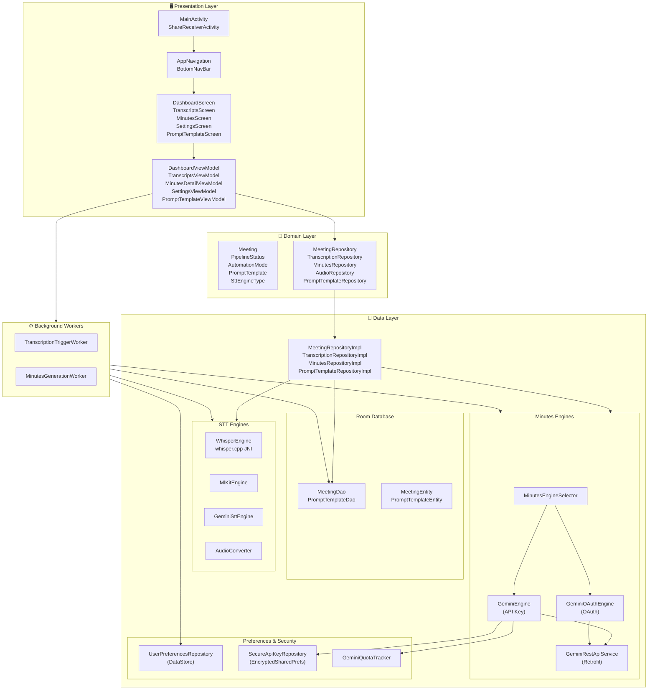
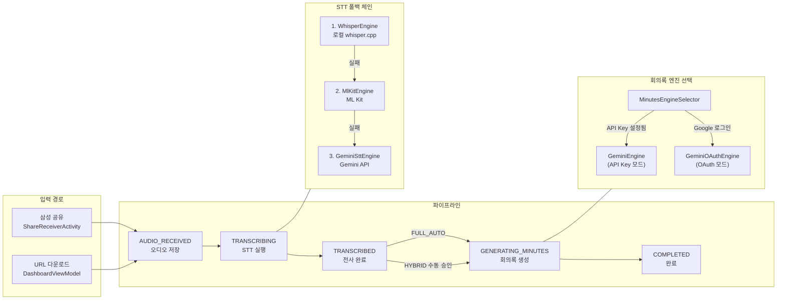
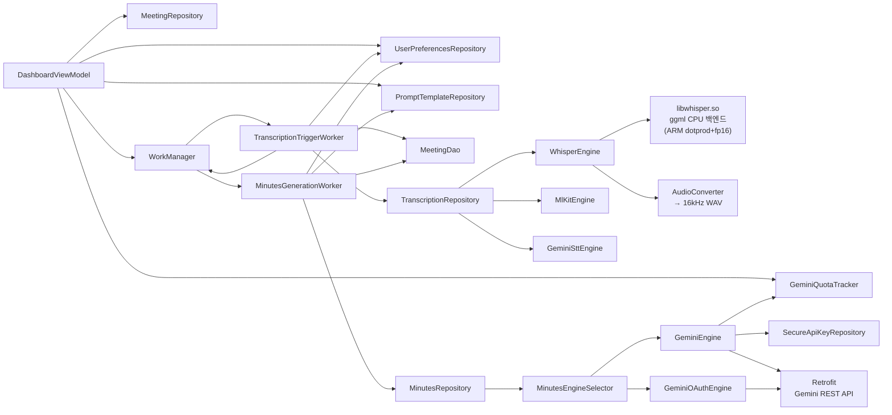
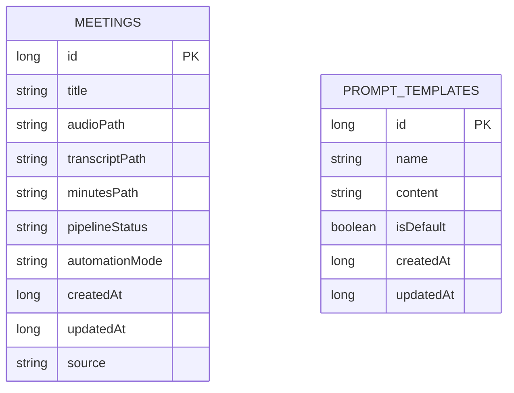
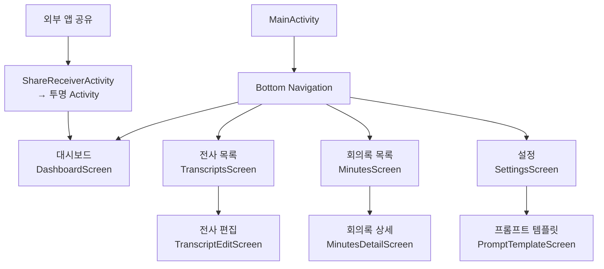

# Codebase Structure

**Analysis Date:** 2026-03-26

## Directory Layout

```
Auto_Minuting/
├── app/                              # 메인 Android 앱 모듈
│   └── src/main/java/com/autominuting/
│       ├── AutoMinutingApplication.kt  # 앱 진입점, Hilt/WorkManager 초기화
│       ├── MainActivity.kt             # UI 진입점, Compose 루트
│       ├── data/                       # Data 레이어
│       │   ├── audio/                  # 오디오 파일 관리
│       │   ├── auth/                   # 인증 상태/모드
│       │   ├── local/                  # Room DB (entity, dao, converter)
│       │   ├── minutes/                # 회의록 생성 엔진 (Gemini)
│       │   ├── preferences/            # DataStore 사용자 설정
│       │   ├── repository/             # Repository 구현체
│       │   ├── security/               # 암호화 저장소
│       │   └── stt/                    # STT 엔진 (Whisper, ML Kit)
│       ├── di/                         # Hilt DI 모듈
│       ├── domain/                     # Domain 레이어
│       │   ├── model/                  # 도메인 모델 (data class, enum)
│       │   ├── repository/             # Repository 인터페이스
│       │   └── usecase/                # (미사용, 예약 디렉토리)
│       ├── presentation/               # Presentation 레이어
│       │   ├── dashboard/              # 대시보드 화면
│       │   ├── minutes/                # 회의록 목록/상세 화면
│       │   ├── navigation/             # 네비게이션 그래프/라우트
│       │   ├── settings/               # 설정 화면
│       │   ├── share/                  # 공유 수신 Activity
│       │   ├── templates/              # 프롬프트 템플릿 화면
│       │   ├── theme/                  # Material 3 테마
│       │   └── transcripts/            # 전사 목록/편집 화면
│       ├── receiver/                   # BroadcastReceiver
│       ├── service/                    # 알림 헬퍼
│       ├── util/                       # 유틸리티
│       └── worker/                     # WorkManager Workers
├── poc/                              # 개념 증명 스크립트
│   ├── minutes-test/
│   ├── plaud-analysis/
│   ├── stt-test/
│   └── results/
├── gradle/                           # Gradle wrapper
├── build.gradle.kts                  # 루트 빌드 설정
├── settings.gradle.kts               # 모듈 설정
└── CLAUDE.md                         # 프로젝트 AI 지침
```

## Directory Purposes

**`data/audio/`:**
- Purpose: 오디오 파일 저장소 관리 유틸리티
- Contains: `AudioFileManager.kt` — 파일 저장 디렉토리, 공간 확인, 파일 유효성 검증, 파일명 생성
- Key files: `app/src/main/java/com/autominuting/data/audio/AudioFileManager.kt`

**`data/auth/`:**
- Purpose: 인증 상태 모델
- Contains: `AuthState.kt`, `GoogleAuthRepository.kt`
- Key files: `app/src/main/java/com/autominuting/data/auth/AuthState.kt`

**`data/local/`:**
- Purpose: Room 데이터베이스 전체
- Contains: `AppDatabase.kt` (v3, 2개 테이블), Entity, DAO, TypeConverter
- Key files:
  - `app/src/main/java/com/autominuting/data/local/AppDatabase.kt`
  - `app/src/main/java/com/autominuting/data/local/entity/MeetingEntity.kt`
  - `app/src/main/java/com/autominuting/data/local/entity/PromptTemplateEntity.kt`
  - `app/src/main/java/com/autominuting/data/local/dao/MeetingDao.kt`
  - `app/src/main/java/com/autominuting/data/local/dao/PromptTemplateDao.kt`
  - `app/src/main/java/com/autominuting/data/local/converter/Converters.kt`

**`data/minutes/`:**
- Purpose: 회의록 생성 엔진 구현체
- Contains: `MinutesEngine.kt` (인터페이스), `MinutesEngineSelector.kt` (동적 엔진 선택), `GeminiEngine.kt` (API 키), `GeminiOAuthEngine.kt` (OAuth), `GeminiRestApiService.kt`, `GeminiRestModels.kt`, `MinutesPrompts.kt`, `BearerTokenInterceptor.kt`
- Key files: `app/src/main/java/com/autominuting/data/minutes/MinutesEngineSelector.kt`

**`data/preferences/`:**
- Purpose: 사용자 설정 영속화 (DataStore)
- Key files: `app/src/main/java/com/autominuting/data/preferences/UserPreferencesRepository.kt`

**`data/repository/`:**
- Purpose: Domain Repository 인터페이스의 구현체
- Key files:
  - `app/src/main/java/com/autominuting/data/repository/MeetingRepositoryImpl.kt`
  - `app/src/main/java/com/autominuting/data/repository/TranscriptionRepositoryImpl.kt`
  - `app/src/main/java/com/autominuting/data/repository/MinutesRepositoryImpl.kt`
  - `app/src/main/java/com/autominuting/data/repository/AudioRepositoryImpl.kt`
  - `app/src/main/java/com/autominuting/data/repository/PromptTemplateRepositoryImpl.kt`

**`data/security/`:**
- Purpose: 민감 데이터 암호화 저장소
- Key files: `app/src/main/java/com/autominuting/data/security/SecureApiKeyRepository.kt`

**`data/stt/`:**
- Purpose: STT 엔진 구현체
- Contains: `SttEngine.kt` (인터페이스), `WhisperEngine.kt` (1차), `MlKitEngine.kt` (2차 폴백), `AudioConverter.kt`
- Key files: `app/src/main/java/com/autominuting/data/stt/SttEngine.kt`

**`di/`:**
- Purpose: Hilt 의존성 주입 모듈
- Key files:
  - `app/src/main/java/com/autominuting/di/RepositoryModule.kt` — 인터페이스↔구현체 바인딩
  - `app/src/main/java/com/autominuting/di/DatabaseModule.kt` — Room DB/DAO 제공
  - `app/src/main/java/com/autominuting/di/DataStoreModule.kt` — DataStore 제공
  - `app/src/main/java/com/autominuting/di/AuthModule.kt` — 인증 관련 의존성
  - `app/src/main/java/com/autominuting/di/WorkerModule.kt` — Worker 의존성

**`domain/model/`:**
- Purpose: Android 독립적 도메인 모델
- Key files:
  - `app/src/main/java/com/autominuting/domain/model/Meeting.kt` — 핵심 도메인 객체
  - `app/src/main/java/com/autominuting/domain/model/PipelineStatus.kt` — 파이프라인 상태 enum
  - `app/src/main/java/com/autominuting/domain/model/AutomationMode.kt` — 자동화 모드 enum
  - `app/src/main/java/com/autominuting/domain/model/MinutesFormat.kt` — 회의록 형식 enum
  - `app/src/main/java/com/autominuting/domain/model/PromptTemplate.kt`

**`domain/repository/`:**
- Purpose: Data 레이어 계약(인터페이스) 정의
- Key files:
  - `app/src/main/java/com/autominuting/domain/repository/MeetingRepository.kt`
  - `app/src/main/java/com/autominuting/domain/repository/TranscriptionRepository.kt`
  - `app/src/main/java/com/autominuting/domain/repository/MinutesRepository.kt`
  - `app/src/main/java/com/autominuting/domain/repository/AudioRepository.kt`
  - `app/src/main/java/com/autominuting/domain/repository/PromptTemplateRepository.kt`

**`presentation/`:**
- Purpose: Compose UI + ViewModel. 화면별로 하위 디렉토리 분리
- Contains: 각 화면 디렉토리에 `{Name}Screen.kt` + `{Name}ViewModel.kt` 쌍

**`presentation/navigation/`:**
- Purpose: 앱 전체 네비게이션
- Key files:
  - `app/src/main/java/com/autominuting/presentation/navigation/AppNavigation.kt` — NavHost + BottomBar
  - `app/src/main/java/com/autominuting/presentation/navigation/Screen.kt` — sealed class 라우트 정의

**`presentation/share/`:**
- Purpose: 외부 앱 공유 수신 (UI 없는 투명 Activity)
- Key files: `app/src/main/java/com/autominuting/presentation/share/ShareReceiverActivity.kt`

**`presentation/theme/`:**
- Purpose: Material 3 테마 정의
- Key files: `app/src/main/java/com/autominuting/presentation/theme/Theme.kt`, `Color.kt`, `Type.kt`

**`receiver/`:**
- Purpose: 알림 액션 BroadcastReceiver
- Key files: `app/src/main/java/com/autominuting/receiver/PipelineActionReceiver.kt`

**`service/`:**
- Purpose: 파이프라인 알림 채널/알림 관리
- Key files: `app/src/main/java/com/autominuting/service/PipelineNotificationHelper.kt`

**`util/`:**
- Purpose: 공통 유틸리티
- Key files: `app/src/main/java/com/autominuting/util/NotebookLmHelper.kt`

**`worker/`:**
- Purpose: WorkManager 백그라운드 파이프라인 실행
- Key files:
  - `app/src/main/java/com/autominuting/worker/TranscriptionTriggerWorker.kt`
  - `app/src/main/java/com/autominuting/worker/MinutesGenerationWorker.kt`
  - `app/src/main/java/com/autominuting/worker/TestWorker.kt`

## Key File Locations

**Entry Points:**
- `app/src/main/java/com/autominuting/AutoMinutingApplication.kt`: 앱 초기화, Hilt, WorkManager, 알림 채널
- `app/src/main/java/com/autominuting/MainActivity.kt`: 주 UI 진입점
- `app/src/main/java/com/autominuting/presentation/share/ShareReceiverActivity.kt`: 외부 공유 수신

**Configuration:**
- `app/build.gradle.kts`: 앱 모듈 빌드 설정, 의존성 선언
- `app/src/main/AndroidManifest.xml`: 컴포넌트 선언, 권한, Intent Filter
- `gradle.properties`: 빌드 플래그 (R8, Compose Compiler 등)

**Core Domain:**
- `app/src/main/java/com/autominuting/domain/model/Meeting.kt`: 핵심 도메인 객체
- `app/src/main/java/com/autominuting/domain/model/PipelineStatus.kt`: 파이프라인 상태 추적 enum

**Pipeline Workers:**
- `app/src/main/java/com/autominuting/worker/TranscriptionTriggerWorker.kt`: STT 파이프라인
- `app/src/main/java/com/autominuting/worker/MinutesGenerationWorker.kt`: 회의록 생성 파이프라인

**Database:**
- `app/src/main/java/com/autominuting/data/local/AppDatabase.kt`: Room DB 정의 (v3)
- `app/schemas/`: Room 스키마 JSON (exportSchema = true)

## Naming Conventions

**Files:**
- 화면: `{FeatureName}Screen.kt` (예: `DashboardScreen.kt`, `MinutesDetailScreen.kt`)
- ViewModel: `{FeatureName}ViewModel.kt` (예: `DashboardViewModel.kt`)
- Repository 인터페이스: `{Domain}Repository.kt` (예: `MeetingRepository.kt`)
- Repository 구현체: `{Domain}RepositoryImpl.kt` (예: `MeetingRepositoryImpl.kt`)
- Room Entity: `{Domain}Entity.kt` (예: `MeetingEntity.kt`)
- Room DAO: `{Domain}Dao.kt` (예: `MeetingDao.kt`)
- Worker: `{Purpose}Worker.kt` (예: `TranscriptionTriggerWorker.kt`)
- Engine 인터페이스: `{Type}Engine.kt` (예: `SttEngine.kt`, `MinutesEngine.kt`)
- DI 모듈: `{Scope}Module.kt` (예: `RepositoryModule.kt`, `DatabaseModule.kt`)

**Directories:**
- 기능(feature)별 단수형 소문자: `dashboard`, `minutes`, `transcripts`, `settings`
- 기술 계층별: `local`, `repository`, `stt`, `minutes`, `preferences`, `security`

## Where to Add New Code

**새 화면 추가:**
- 화면 코드: `app/src/main/java/com/autominuting/presentation/{featureName}/{FeatureName}Screen.kt`
- ViewModel: `app/src/main/java/com/autominuting/presentation/{featureName}/{FeatureName}ViewModel.kt`
- 라우트 등록: `app/src/main/java/com/autominuting/presentation/navigation/Screen.kt` sealed class에 추가
- NavHost 연결: `app/src/main/java/com/autominuting/presentation/navigation/AppNavigation.kt`에 `composable()` 블록 추가

**새 도메인 기능 추가:**
- 도메인 모델: `app/src/main/java/com/autominuting/domain/model/{ModelName}.kt`
- Repository 인터페이스: `app/src/main/java/com/autominuting/domain/repository/{Name}Repository.kt`
- Repository 구현체: `app/src/main/java/com/autominuting/data/repository/{Name}RepositoryImpl.kt`
- DI 바인딩: `app/src/main/java/com/autominuting/di/RepositoryModule.kt`에 `@Binds` 추가

**새 백그라운드 작업 추가:**
- Worker: `app/src/main/java/com/autominuting/worker/{Purpose}Worker.kt`
- `@HiltWorker` + `@AssistedInject constructor(@Assisted Context, @Assisted WorkerParameters, ...)` 패턴 사용

**새 엔진(STT/Minutes) 추가:**
- STT: `SttEngine` 인터페이스 구현 → `app/src/main/java/com/autominuting/data/stt/`
- Minutes: `MinutesEngine` 인터페이스 구현 → `app/src/main/java/com/autominuting/data/minutes/`
- `MinutesEngineSelector`에 선택 로직 추가

**공통 유틸리티:**
- `app/src/main/java/com/autominuting/util/`

**새 Room 테이블:**
- Entity: `app/src/main/java/com/autominuting/data/local/entity/`
- DAO: `app/src/main/java/com/autominuting/data/local/dao/`
- `AppDatabase.kt`의 `entities` 배열에 추가, `version` 증가, Migration 객체 작성

## Special Directories

**`poc/`:**
- Purpose: 개념 증명 스크립트 (minutes-test, plaud-analysis, stt-test, results)
- Generated: No
- Committed: Yes (분석 자료)

**`app/schemas/`:**
- Purpose: Room 스키마 JSON 자동 내보내기 (`exportSchema = true`)
- Generated: Yes (Room 컴파일 시)
- Committed: Yes (마이그레이션 검증용)

**`app/build/`:**
- Purpose: 빌드 출력물
- Generated: Yes
- Committed: No (`.gitignore`)

**`.planning/`:**
- Purpose: GSD 워크플로 플래닝 아티팩트
- Generated: No (수동/AI 작성)
- Committed: Yes

---

## System Architecture Diagrams

*Updated: 2026-03-30*

### 1. 전체 레이어 구조



```text
┌─────────────────────────────────────────────────────────────────────────────┐
│  PRESENTATION LAYER                                                          │
│                                                                              │
│  MainActivity ──► AppNavigation ──► DashboardScreen   ── DashboardViewModel │
│  ShareReceiverActivity            TranscriptsScreen   ── TranscriptsViewModel│
│                                   MinutesScreen       ── MinutesDetailVM    │
│                                   SettingsScreen      ── SettingsViewModel  │
│                                   PromptTemplateScreen── PromptTemplateVM   │
└────────────────────────────┬──────────────────────┬───────────────────────-─┘
                             │ uses (interface)      │ enqueues
                             ▼                       ▼
┌────────────────────────────────────┐   ┌──────────────────────────────────┐
│  DOMAIN LAYER                      │   │  BACKGROUND WORKERS              │
│                                    │   │                                  │
│  Models:                           │   │  TranscriptionTriggerWorker      │
│    Meeting  PipelineStatus         │   │  MinutesGenerationWorker         │
│    AutomationMode  PromptTemplate  │   │                                  │
│                                    │   │  (WorkManager / @HiltWorker)     │
│  Repository Interfaces:            │   └──────────┬───────────────────────┘
│    MeetingRepository               │              │ uses
│    TranscriptionRepository         │              │
│    MinutesRepository               │              │
│    AudioRepository                 │              │
│    PromptTemplateRepository        │              │
└────────────────────┬───────────────┘              │
                     │ implements                    │
                     ▼                               ▼
┌────────────────────────────────────────────────────────────────────────────┐
│  DATA LAYER                                                                  │
│                                                                              │
│  ┌──────────────────────┐  ┌──────────────────────┐  ┌───────────────────┐ │
│  │  Room Database        │  │  STT Engines          │  │  Minutes Engines  │ │
│  │                       │  │                       │  │                   │ │
│  │  MeetingDao           │  │  WhisperEngine        │  │  EngineSelector   │ │
│  │  PromptTemplateDao    │  │  └─ whisper.cpp JNI   │  │  ├─ GeminiEngine  │ │
│  │  MeetingEntity        │  │     (ARM dotprod+fp16)│  │  │  (API Key)     │ │
│  │  PromptTemplateEntity │  │  MlKitEngine          │  │  └─ GeminiOAuth   │ │
│  │                       │  │  GeminiSttEngine      │  │     Engine        │ │
│  │  AppDatabase (v3)     │  │  AudioConverter       │  │  GeminiRestApi    │ │
│  └──────────────────────┘  └──────────────────────┘  │  Service(Retrofit) │ │
│                                                        └───────────────────┘ │
│  ┌──────────────────────────────────────────────────────────────────────┐   │
│  │  Preferences & Security                                               │   │
│  │  UserPreferencesRepository(DataStore)  SecureApiKeyRepository        │   │
│  │  GeminiQuotaTracker                                                   │   │
│  └──────────────────────────────────────────────────────────────────────┘   │
│                                                                              │
│  Repository Impls: MeetingRepositoryImpl  TranscriptionRepositoryImpl        │
│                    MinutesRepositoryImpl  PromptTemplateRepositoryImpl       │
└────────────────────────────────────────────────────────────────────────────┘
```

---

### 2. 파이프라인 흐름



```text
  입력 경로                      파이프라인 상태                   엔진
  ──────────                     ──────────────────               ────────────────────────────
  삼성 공유          ┐            AUDIO_RECEIVED                   STT 폴백 체인
  ShareReceiver ────┤──────────► (오디오 저장)                     1. WhisperEngine (로컬)
                    │                   │                               │ 실패
  URL 다운로드       │            TRANSCRIBING ◄───────────────────     ▼
  DashboardVM  ─────┘            (STT 실행)    TranscriptionTW    2. MlKitEngine
                                        │                               │ 실패
                                        ▼                               ▼
                                 TRANSCRIBED                      3. GeminiSttEngine
                                 (전사 완료)
                                        │                         회의록 엔진 선택
                              ┌─────────┴──────────┐             ────────────────────────────
                     FULL_AUTO│          HYBRID 수동 승인후       MinutesEngineSelector
                              ▼                    ▼                   ├─ GeminiEngine
                       GENERATING_MINUTES   MGW enqueue                │  (API Key 설정됨)
                       (회의록 생성) ◄───────────────────────          └─ GeminiOAuthEngine
                       MinutesGenerationWorker                            (Google 로그인)
                              │
                              ▼
                          COMPLETED
```

---

### 3. 컴포넌트 의존 관계



```text
  DashboardViewModel
  ├── MeetingRepository ──────────────► MeetingRepositoryImpl ──► MeetingDao
  ├── UserPreferencesRepository ──────────────────────────────► DataStore
  ├── PromptTemplateRepository ───────► PromptTemplateRepositoryImpl ──► PromptTemplateDao
  ├── GeminiQuotaTracker ─────────────────────────────────────► DataStore (shared)
  └── WorkManager
        ├──► TranscriptionTriggerWorker
        │      ├── MeetingDao
        │      ├── UserPreferencesRepository
        │      ├── WorkManager (체이닝)
        │      └── TranscriptionRepository
        │            └── TranscriptionRepositoryImpl
        │                  ├── WhisperEngine ──► libwhisper.so (ggml, ARM dotprod+fp16)
        │                  │                    └── AudioConverter (→ 16kHz WAV)
        │                  ├── MlKitEngine   (폴백 1)
        │                  └── GeminiSttEngine (폴백 2)
        │
        └──► MinutesGenerationWorker
               ├── MeetingDao
               ├── UserPreferencesRepository
               ├── PromptTemplateRepository
               └── MinutesRepository
                     └── MinutesRepositoryImpl
                           └── MinutesEngineSelector
                                 ├── GeminiEngine (API Key)
                                 │     ├── SecureApiKeyRepository (EncryptedSharedPrefs)
                                 │     ├── GeminiQuotaTracker
                                 │     └── GeminiRestApiService (Retrofit + OkHttp)
                                 └── GeminiOAuthEngine (OAuth)
                                       ├── GoogleAuthRepository
                                       └── GeminiRestApiService (BearerTokenInterceptor)
```

---

### 4. Room DB 스키마



```text
  ┌─────────────────────────────────────┐   ┌───────────────────────────────────┐
  │  meetings                           │   │  prompt_templates                 │
  ├─────────────────────────────────────┤   ├───────────────────────────────────┤
  │  id             LONG  PK            │   │  id             LONG  PK          │
  │  title          TEXT                │   │  name           TEXT              │
  │  audioPath      TEXT                │   │  content        TEXT              │
  │  transcriptPath TEXT                │   │  isDefault      BOOLEAN           │
  │  minutesPath    TEXT                │   │  createdAt      LONG              │
  │  pipelineStatus TEXT  (enum)        │   │  updatedAt      LONG              │
  │  automationMode TEXT  (enum)        │   └───────────────────────────────────┘
  │  createdAt      LONG                │
  │  updatedAt      LONG                │   pipelineStatus 값:
  │  source         TEXT                │     AUDIO_RECEIVED → TRANSCRIBING
  └─────────────────────────────────────┘     → TRANSCRIBED → GENERATING_MINUTES
                                              → COMPLETED / FAILED
```

---

### 5. 화면 네비게이션 구조



```text
  MainActivity
  └── AppNavigation
        └── Bottom Navigation (4탭)
              ├── [1] 대시보드 ──────────────────────► DashboardScreen
              │                                          (파이프라인 현황, URL 입력)
              │
              ├── [2] 전사 목록 ──────────────────────► TranscriptsScreen
              │                                                │
              │                                               [탭] 항목 선택
              │                                                ▼
              │                                          TranscriptEditScreen
              │                                          (전사 편집 / 회의록 수동 생성)
              │
              ├── [3] 회의록 목록 ─────────────────────► MinutesScreen
              │                                                │
              │                                               [탭] 항목 선택
              │                                                ▼
              │                                          MinutesDetailScreen
              │                                          (회의록 보기 / 재생성)
              │
              └── [4] 설정 ──────────────────────────► SettingsScreen
                                                               │
                                                              [탭] 프롬프트 템플릿
                                                               ▼
                                                        PromptTemplateScreen

  외부 앱 공유 (삼성 My Files 등)
  └── ShareReceiverActivity  (투명, UI 없음)
        └── 오디오 파일 수신 → MeetingEntity 생성 → 파이프라인 시작 → 대시보드로 이동
```

---

*Diagrams updated: 2026-03-30*
